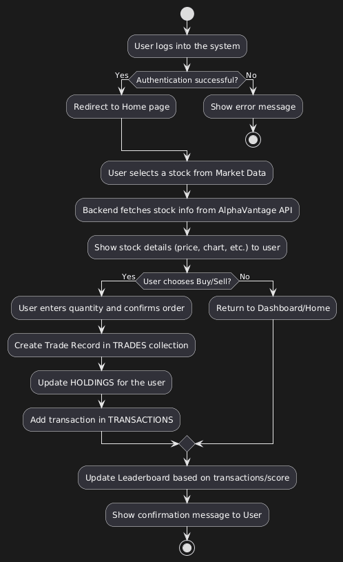
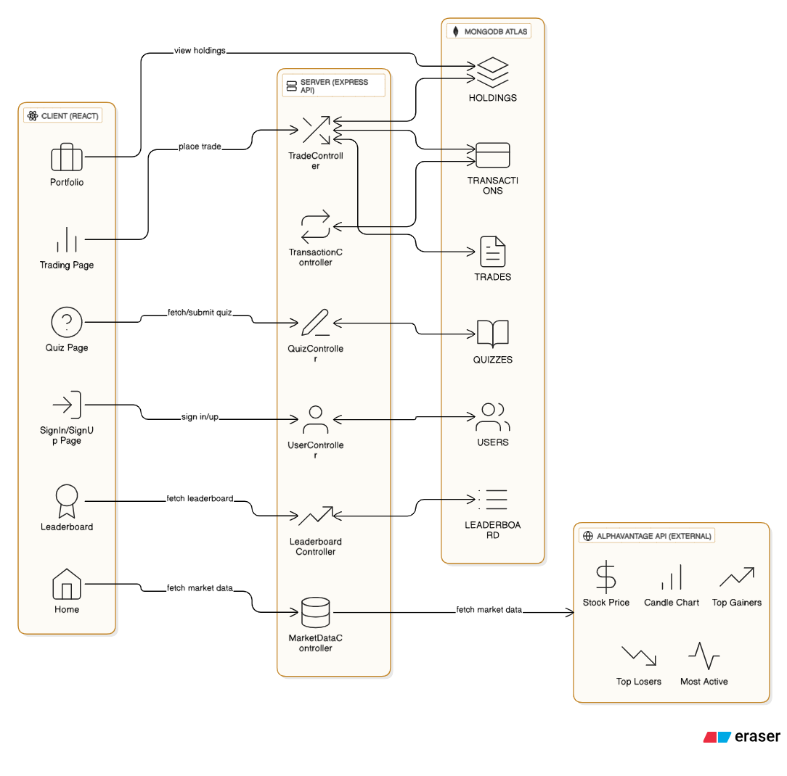
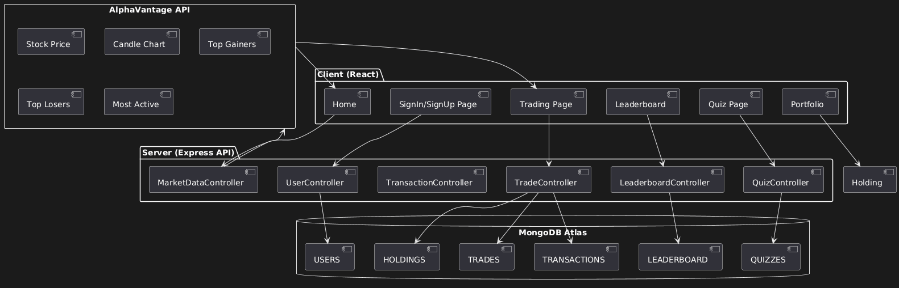
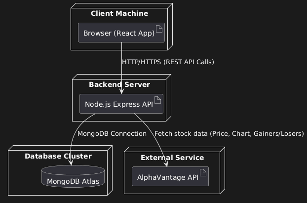
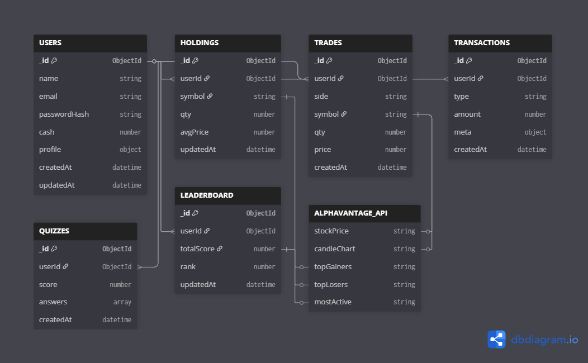
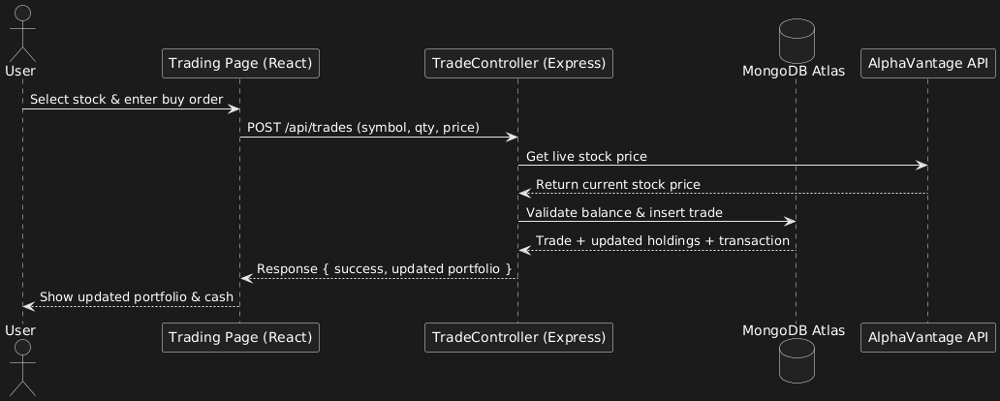
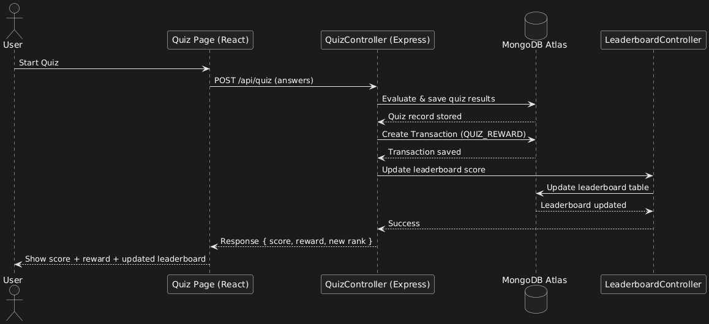

## 📊 Diagrams

- **Activity Diagram**  
  Shows the step-by-step workflow of a user performing trading actions (sign in → buy/sell → portfolio update).  
  

- **Architecture Diagram**  
  High-level overview of system components: Client (React), Server (Express API), Database (MongoDB Atlas), and AlphaVantage API.  
  

- **Component Diagram**  
  Breaks down the application into functional components (Authentication, Portfolio, Trading, Quiz, Leaderboard) and shows their interactions.  
  

- **Deployment Diagram**  
  Explains where and how the app runs: React frontend, Node/Express backend, MongoDB Atlas (cloud), and AlphaVantage external API.  
   

- **Entity Relationship (ER) Diagram**  
  Defines database tables (Users, Trades, Holdings, Transactions, Leaderboard, Quizzes) and relationships (1-to-many, many-to-one).  
  

- **Sequence Diagram 1 – Trading Flow**  
  Demonstrates the sequence of events when a user places a trade (request → validation → DB update → response).  
  

- **Sequence Diagram 2 – Quiz Flow**  
  Illustrates how the user attempts a quiz, data is stored, and leaderboard updates accordingly.  
  

## 🔗 API Contract (Swagger/OpenAPI)

- **AlphaVantage Market Data API (Wrapped)**  
  Backend endpoints for stock market data (`/market/price`, `/market/candle`, `/market/top-gainers`, `/market/top-losers`, `/market/most-active`) using AlphaVantage as the data source.

  [api-contract](./API%20Contract.docx)
---

## 📌 Summary

- Provides **visual diagrams** for system understanding.  
- Defines **database schema** and entity relationships.  
- Documents **REST API contracts** for market data integration.  
- Forms the foundation for a scalable and maintainable trading application.
